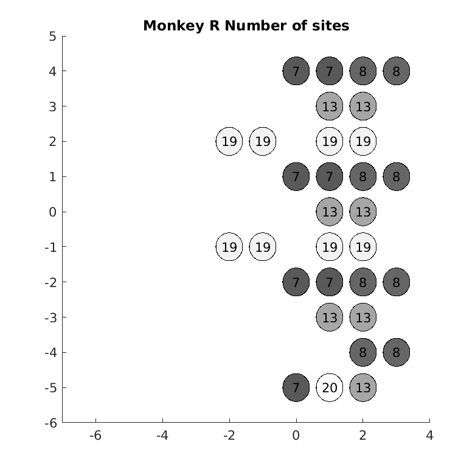
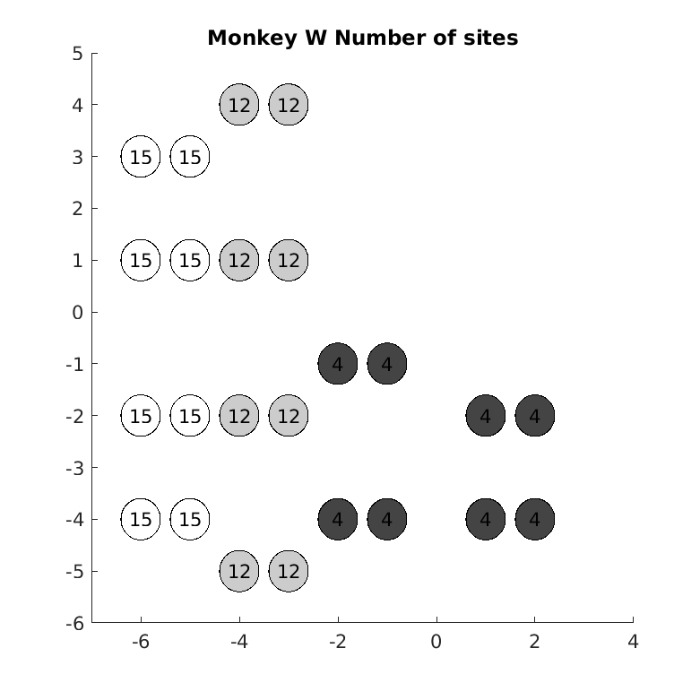

# Spatial Outlay of the recording
- During recording, a chamber was implanted for each monkey over each region. Several insertion windows were fixated on the grid.

    - Monkey R: **31** sites in PFC; **31** sites in VIP
    - Monkey W: **24** sites in PFC; **33** sites in VIP
- Each session 8 electrodes (4 pairs) were inserted into each region, thus as random spatial-sampling of the cortex
- Patterns change every several sessions, for PFC locations, see [locations](https://gitlab.lrz.de/jacob_lab/jacoblabmonkey/-/blob/master/code/14.OCPspatial/locations.txt) and [defineLoc_PFC](https://gitlab.lrz.de/jacob_lab/jacoblabmonkey/-/blob/master/code/14.OCPspatial/defineLoc_PFC.m)
- Count of electrodes at each site, see:

# Sensory Beta bursts
- see [BetaTransSpatial](https://gitlab.lrz.de/jacob_lab/jacoblabmonkey/-/blob/master/code/14.OCPspatial/BetaTransSpatial.m)
- The number of channels that Beta onset transient was recorded at each site (in percentage):

**The distribution of burst features are not homogeneous across spatial locations**

# Site-average burst prob. fluctuation
- See [Acrossess_Burst_Prof](https://gitlab.lrz.de/jacob_lab/jacoblabmonkey/-/tree/master/code/14.OCPspatial/Acrossess_Burst_Prof.m)
- Average burst-prob. traces at each site

- Snapshots

# Burst probability for different numbers
- See [Acrossess_Burst_Prob_Num](https://gitlab.lrz.de/jacob_lab/jacoblabmonkey/-/blob/master/code/14.OCPspatial/Acrossess_Burst_Prob_Num.m)

- Gifs see `./data/14.OCPspatial/AvgBrstSpatial/bynum`

# Burst sequences
- Burst occurrence in successive order across space can be used to identify bursts of similar origin

 Example trials 

- see [Sess_brst_spatial_exp_trls](https://gitlab.lrz.de/jacob_lab/jacoblabmonkey/-/blob/master/code/14.OCPspatial/Sess_brst_spatial_exp_trls.m)

- See section [6.BurstSeq](Burst-sequence-sorting)

# Spatial spread of bursts
- Burst-triggered average spectrograms, see [BTA_spec_pipeline](https://gitlab.lrz.de/jacob_lab/jacoblabmonkey/-/blob/master/code/14.OCPspatial/BTA_spec_pipeline.m) and [BTA_spec](https://gitlab.lrz.de/jacob_lab/jacoblabmonkey/-/blob/master/code/14.OCPspatial/BTA_spec.m):

 Example session 

- see [plot_BTA_spec](https://gitlab.lrz.de/jacob_lab/jacoblabmonkey/-/blob/master/code/14.OCPspatial/plot_BTA_spec.m)

- plot by distance, see [BTA_spec_dist](https://gitlab.lrz.de/jacob_lab/jacoblabmonkey/-/blob/master/code/14.OCPspatial/BTA_spec_dist.m):

# OCP correlation between channels
- Correlation matrix for each session, see [OCP_corr_sites](https://gitlab.lrz.de/jacob_lab/jacoblabmonkey/-/tree/master/code/14.OCPspatial/OCPcrosscorr/OCP_corr_sites.m)
    - Session-figures at `/mnt/storage/xuanyu/MONKEY/Non-ion/13.PerfOCP/OCPcorrSites_figs`
    

 Example sessions

    - Dark bars indicate channels without valid unit
    
    

    

## OCP coupling by distance
- Correlation sorted and averaged by distance (binned by the floor value), see [OCP_corr_dist](https://gitlab.lrz.de/jacob_lab/jacoblabmonkey/-/tree/master/code/14.OCPspatial/OCPcrosscorr/OCP_corr_dist.m)
    - In case OCP coupling is biased by electrodes in CSF, the results obtained only from channels with valid neuron (`validneu`) is also displayed
    - All pairs: 4872 (2436 bi-directional pairs)
    - Valid neuron: 2288/4872 (47.0%)

- Only Valid neuron plotted (shaded: MSE)

## OCP coupling with spatial layout
- Correlation matrix was sorted by the sites across sessions, average CC displayed as heatmap. See [OCP_corr_sites](https://gitlab.lrz.de/jacob_lab/jacoblabmonkey/-/blob/master/code/14.OCPspatial/OCPcrosscorr/OCP_corr_sites.m)

- spatial glittering added to minimize overlap between lines

## PEV by spatial location
- see [PEVspatial](https://gitlab.lrz.de/jacob_lab/jacoblabmonkey/-/blob/master/code/14.OCPspatial/PEVspatial/PEVspatial.m)

 Too few MUAs for each site: 

