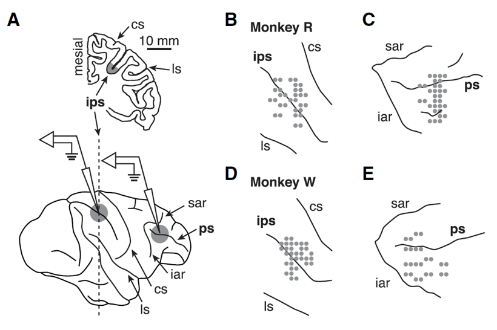
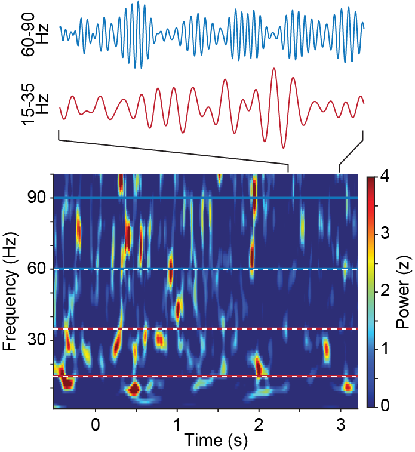
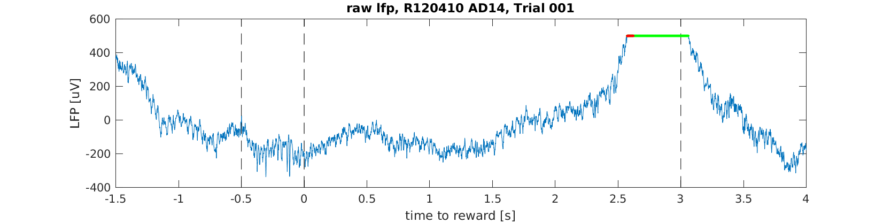
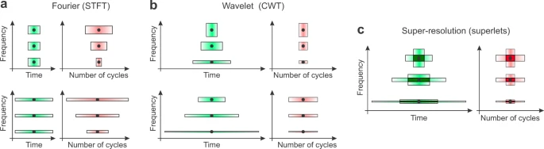
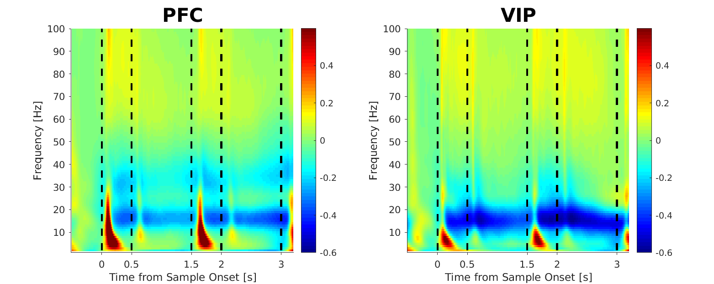
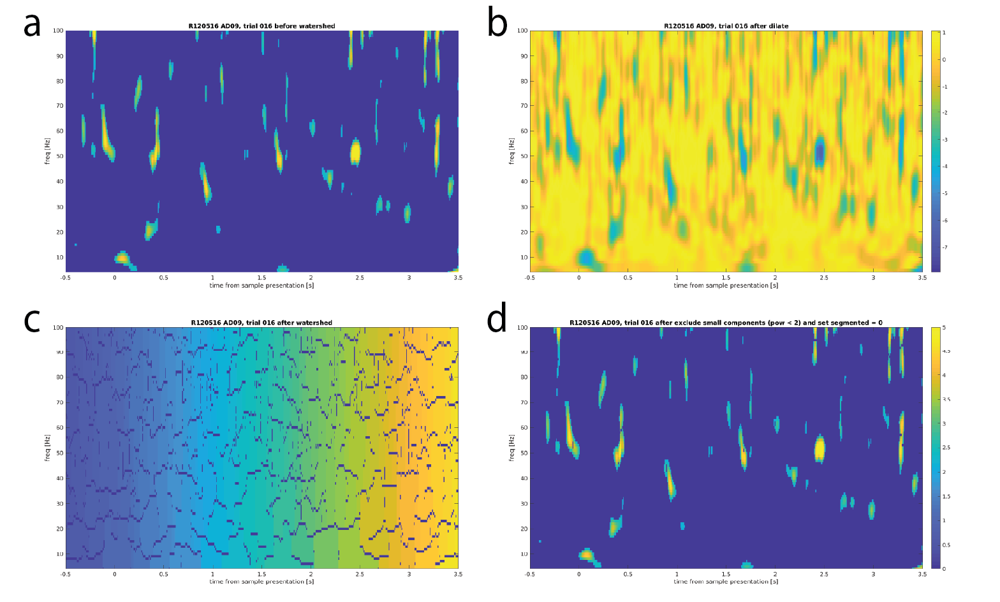
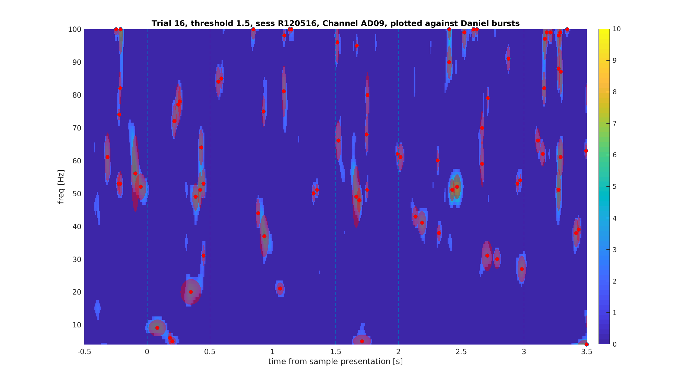
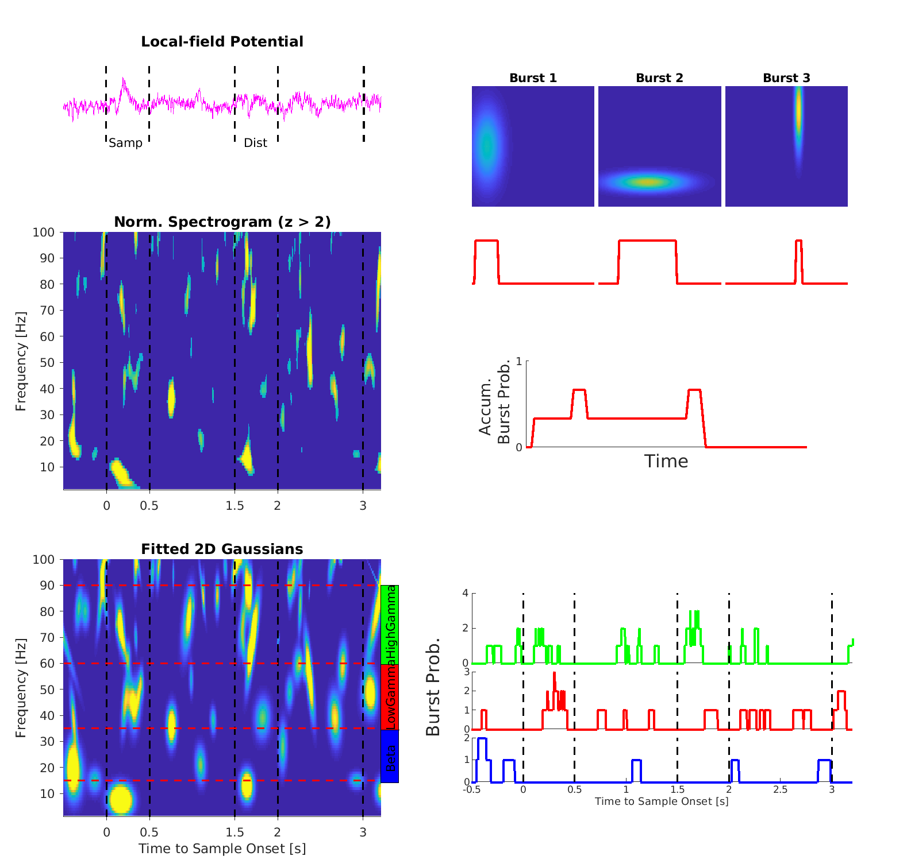
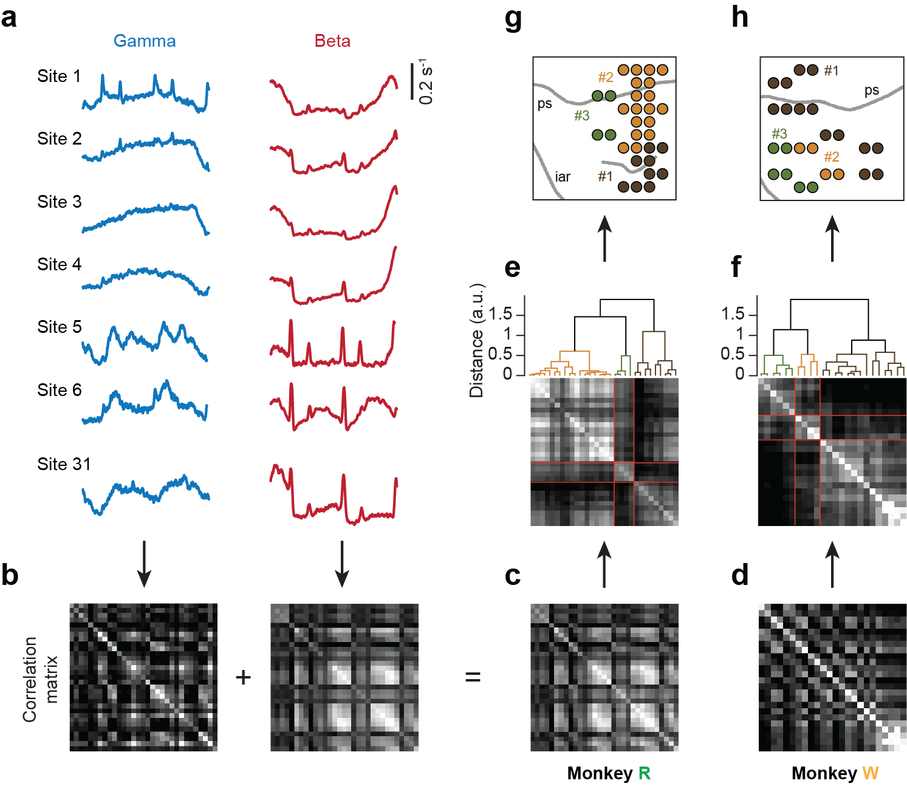

# JacobLab_MonkeyBurst
This repo contains the scripts used for analyzing LFP bursts and clustering their spatiotemporal patterns. See [Wang, *et al.*, 2025](https://www.biorxiv.org/content/10.1101/2024.08.05.606700v2)

It is based on the monkey extracellular recording in PFC and VIP during a number working memory task (see [Jacob *et al.*, 2014](https://www.cell.com/neuron/fulltext/S0896-6273(14)00395-X?elsca1=etoc&elsca3=0896-6273_20140702_83_1_&elsca2=email&elsca4=Cell+Press)). The data were collected by [Prof. Dr. Simon N. Jacob](https://www.professoren.tum.de/en/jacob-simon) as his postdoctoral work at the Center for Integrative Neuroscience in Tübingen.

My analytical focus was on the functional organization of monkey lPFC as revealed by spatiotemporal patterns of transient, short-life bursts in the local field potential (LFP).




# Dependencies
All analysis scripts are based on MATLAB 2018a, and should be compatible across later versions.

# Structure of the current repo
The current repository contains critical scripts used for extracting LFP bursts from the time-series signal, located in the `Preprocessing` folder. The other scripts that leads to the figures in the publication are in the `Analysis` folder.

Data of example sessions (`.nex` format for raw LFP and `.nexctx` for spikes and behavior data) can be provided upon reasonable request  to [Xuanyu Wang](mailto:xuanyu.wang@tum.de) or [Simon Jacob](mailto:simon.jacob@tum.de). To run the preprocessing pipeline, simply put the raw data inside the `Data` folder.

# Preprocessing
The preprocessing pipeline for LFP burst extraction is split into following steps. All scripts were run via parallel computing tool in MATLAB which operates on multiple cores of CPU.

## 0. Trial screening
Please check `Preprocessing/0_TrialScreening_Pipeline_inclerror.m` and `Preprocessing/trialfun_inclerror.m`.

Trials were segmented into a length of [-1.5, 4]s relative to the sample onset, (i.e., `pretrl = 1.5; posttrl = 1; triallen = 3`), saturated signals were removed by labeling the trial as `badtrial` if a saturation of >50 ms was recorded in a single trial.



## 1. Spectral transformation
Please check `Preprocessing/1_Preprocessing_Pipeline_inclerror.m`.

Spectral analysis of this project was performed with [Additive Adaptive-Superlet Method](https://www.nature.com/articles/s41467-020-20539-9) to maximize both spectral and temporal resolution. All data was convert to **single** precision to minimize storage space. Time of interest was restricted to [-1, 4]s with 1 ms data resolution.


[Moca *et al.*, 2021](https://www.nature.com/articles/s41467-020-20539-9)

The following parameters was set for the Superlet function as implemented in Fieldtrip:

<pre lang="matlab">
```
cfg_prep.method              = 'superlet';
cfg_prep.output              = 'pow'; # superlet was only computed for power, the spectral phase was estimated separately with multitapers
cfg_prep.pad                 = 'nextpow2';
cfg_prep.padtype             = 'zero';
cfg_prep.polyremoval         = 0;
cfg_prep.foi                 = 2:128; # liner frequency scale set with 1Hz resolution
cfg_prep.toi                 = -1:0.001:4; % result padded with 1s
cfg_prep.superlet.basewidth  = 3; # the width of base kernal of superlets
cfg_prep.superlet.combine    = 'additive'; # the estimated value from individual wavelets was summed up additively
cfg_prep.superlet.order      = round(linspace(1,30,numel(cfg_prep.foi))); # the range of cycles of wavelets up to basewidth * order
cfg_prep.superlet.gwidth 	 = 3; # the default value for gaussian SD which controls wavelet smoothness
```
</pre>

## 2. Normalization
Please check `Preprocessing/2_Normalization_Pipeline_inclerror.m`.

In order to extract bursts with comparable standards across different band frequency, the LFP power was normalized to the overall fluctuation with a sliding window of 10 trials tracing back from the current trial, i.e. -9~0 previous trials.

The bands of interest were defined based on combining observations of band separation in our own dataset (see figure below) and on previous researches, e.g. [Jacob *et al.*, 2018](https://www.cell.com/neuron/fulltext/S0896-6273(18)30599-3), [Lundqvist *et al.*, 2016](https://www.nature.com/articles/s41467-017-02791-8). The primary focus is on the beta band (15-35Hz) and the Gamma band (60-90Hz)



## 3. Burst extraction
Please check `Preprocessing/3_Burst_Extraction_Pipeline_inclerror.m`.

LFP bursts were extracted by fitting 2-D gaussian ellipses to the spectrogram of each trial, see `Preprocessing/func_bursts/burst_estimation/addburst.m`.

- a) NaN values were submitted.
- b) The image was dilated.
- c) Reverse the sign and perform watershed for segmenting nearby bursts by adding 0s inbetween.
- d) Subsegment the closeby components and fit with 2D gaussians




## 4. Calculate burst probability
Please check `Preprocessing/4_All_prop_pipeline_inclerror.m`.

Burst occurrence was accumulated with step functions that extend its temporal spread. Only bursts with a duration of > 1 cycle and contains no saturation data points were included.



# Analysis
## Clustering with burst patterns
Please check `Analysis/Fig.3b-h_PCA_BR_avgcovmat.m`.

To quantify the similarity of burst patterns between electrodes, we calculated Pearson correlations between mean gamma and beta burst probabilities of all recording sites and performed hierarchical agglomerative clustering (with MATLAB `linkage` and `dendrogram` functions on the covariance matrix) on the correlation matrix summed across the two frequency bands.



Additionally, the consistency of clustering was tested with split-half permutations across trials. Please check `Analysis/Fig.3i&j_Fig.S3_PCA_BR_avgcovmat_consistence.m`

## Connectivity with spike-field coupling
Instantaneous phase of LFP was estimated with multitaper method as implemented in Fieldtrip, with 3-cycle hanning window and the same frequency/temporal resolution as in the Superlet method. Please check `Analysis/func_processing/Extract_Phase_pipeline.m`

For the spike-field coupling, instantaneous phases of spikes were estimated with spike-triggered spectrogram. Please check `Analysis/func_processing/SFC_spiketrigspctrm.m`. Following this, a bias-free pairwise-phase consistency (PPC) measure ([Vinck *et al.*, 2010](https://pubmed.ncbi.nlm.nih.gov/20114076/)) was computed on the instantaneous phases of each pair of spikes. Please check `Analysis/func_processing/SFC_crossreg.m`. Further statistics were performed in different ways:

- (1) with spliting spikes into inside/outside bursts (*Fig.S1e*)
- (2) within or across PFC clusters or with VIP (*Fig.4*)
- (3) across the whole trial (*Fig.S1e*) or in a time-resolved manner (*Fig.4*).

## Connectivity with field-field Granger Causality
Inter-channel spike-field coupling and LFP granger causality were conducted as measurements of connectivity. The connectivity was analyzed between channels within one cluster, between PFC clusters, and between PFC-VIP pairs.

For the pairs within or between PFC clusters, multivariate GC was used to minimize mutual influence from other clusters. Please check `Analysis/func_processing/Granger_multivariate_pipeline.m`.

For the pairs between PFC and VIP, regular GC was used. Please check `Analysis/func_processing/Granger_pipeline.m`.